# GrowTracker

Welcome to grow tracker. This is a utility app designed for gardening and tracking various parameters of your grow.

[](https://travis-ci.com/7LPdWcaW/GrowTracker-Android)
[](https://github.com/7LPdWcaW/GrowTracker-Android/releases/tag/latest)
[](https://t.me/GrowTracker) 
[](https://reddit.com/r/growutils)
[](https://github.com/7LPdWcaW/GrowTracker-Android/blob/master/LICENSE)

# Install

[](https://github.com/7LPdWcaW/GrowTracker-Android/releases)
[](https://f-droid.org/en/packages/me.anon.grow/)

[](https://f-droid.org/en/packages/me.anon.grow/)

The app requires no permissions except for external storage (for caching plant data and images) which you can see [here](https://github.com/7LPdWcaW/GrowTracker-Android/blob/develop/app/src/main/AndroidManifest.xml) in order for users to maintain anonymity, and a minimum Android version of `4.2` and above

- [Latest Nightly Build (Experimental!)](https://github.com/7LPdWcaW/GrowTracker-Android/releases/tag/alpha)

- [Latest APK: (SHA256) 501786b7350eceb7b894a5745c06c378f1d2f2e6f4bf659ee2576b3dfaca5732 v2.6.1](https://github.com/7LPdWcaW/GrowTracker-Android/releases/download/v2.6.1/v2.6.1-production.apk)

- [Latest APK (English only): (SHA256) e366c67c54548da4c46206c953e8847ba6e4c933449ca8d33525601ee2d87bb8 v2.6.1](https://github.com/7LPdWcaW/GrowTracker-Android/releases/download/v2.6.1/v2.6.1-en.apk)

- [Latest APK (Discrete): (SHA256) 3b5edaceb462c6fcd51d11652943357976f75b53dacdfe650f422933357688d9 v2.6.1](https://github.com/7LPdWcaW/GrowTracker-Android/releases/download/v2.6.1/v2.6.1-discrete.apk)

## How to install from APK

1. Follow [this guide](http://www.inbox.com/article/how-do-enable-third-party-apps-on-android.html) to enable unknown sources
2. Download the APK from [here](https://github.com/7LPdWcaW/GrowTracker-Android/releases)
3. Click on downloaded app and install

## Updating

You can either elect to update manually, or get notified on releases by installing the [Update plugin](https://github.com/7LPdWcaW/GrowUpdater-Android/releases).

**For updates, do not uninstall first, you will lose your existing plant data. Always back up your data!**

Installing the app via F-Droid makes it updateable through the F-Droid mechanism.

# Screenshots

[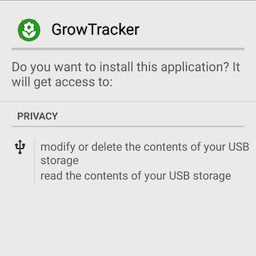](fastlane/metadata/android/en-GB/images/phoneScreenshots/install.png)
[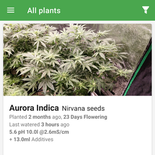](fastlane/metadata/android/en-GB/images/phoneScreenshots/1.png)
[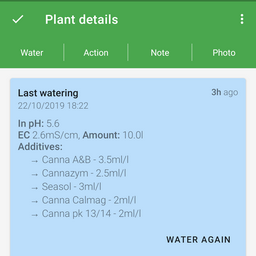](fastlane/metadata/android/en-GB/images/phoneScreenshots/2.png)

<details>
  <summary>More screenshots</summary>

[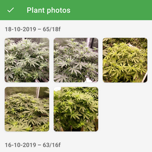](fastlane/metadata/android/en-GB/images/phoneScreenshots/3.png)
[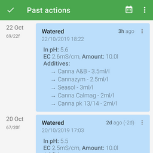](fastlane/metadata/android/en-GB/images/phoneScreenshots/4.png)
[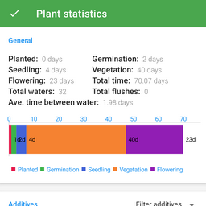](fastlane/metadata/android/en-GB/images/phoneScreenshots/5.png)
[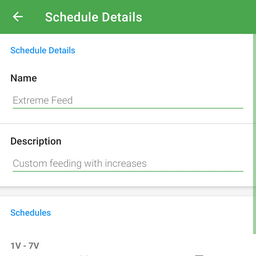](fastlane/metadata/android/en-GB/images/phoneScreenshots/6.png)
[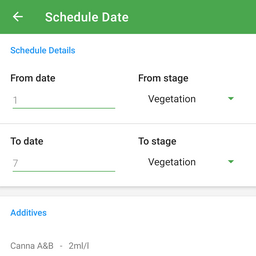](fastlane/metadata/android/en-GB/images/phoneScreenshots/7.png)
[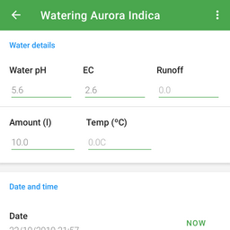](fastlane/metadata/android/en-GB/images/phoneScreenshots/8.png)
[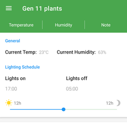](fastlane/metadata/android/en-GB/images/phoneScreenshots/9.png)
[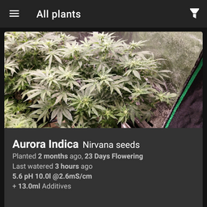](fastlane/metadata/android/en-GB/images/phoneScreenshots/1b.png)
[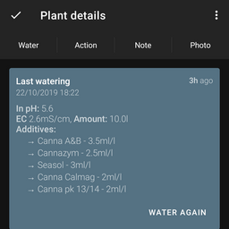](fastlane/metadata/android/en-GB/images/phoneScreenshots/2b.png)
[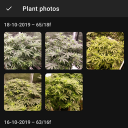](fastlane/metadata/android/en-GB/images/phoneScreenshots/3b.png)
[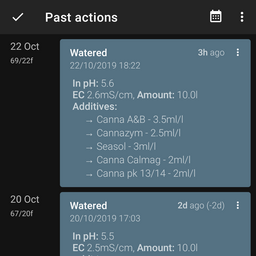](fastlane/metadata/android/en-GB/images/phoneScreenshots/4b.png)
[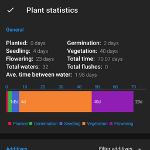](fastlane/metadata/android/en-GB/images/phoneScreenshots/5b.png)
[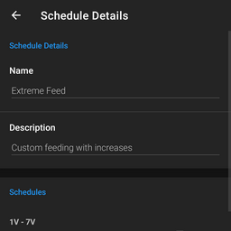](fastlane/metadata/android/en-GB/images/phoneScreenshots/6b.png)
[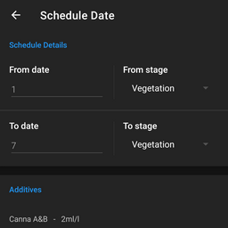](fastlane/metadata/android/en-GB/images/phoneScreenshots/7b.png)
[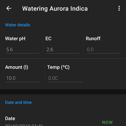](fastlane/metadata/android/en-GB/images/phoneScreenshots/8b.png)
[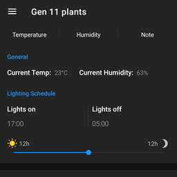](fastlane/metadata/android/en-GB/images/phoneScreenshots/9b.png)
[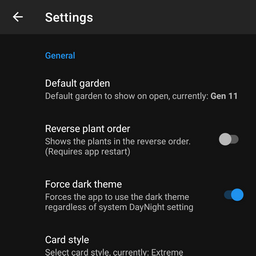](fastlane/metadata/android/en-GB/images/phoneScreenshots/10.png)

</details>

    
# About the app

The app was designed with data in mind. All data is easily accessible via the app's files folder in `Android/data/me.anon.grow/files/`. You will need a file explorer to browse this folder, or alternatively, you can back your data up via the app settings which will create copies in `backups/GrowTracker/`

The structure is very simple, and consists of a few different objects.

*Note*: date timestamps are all unix timestamps from 1/1/1970 in milliseconds. All objects in arrays are in date order, where index 0 is the oldest and index (size - 1) is the newest.

## Plant object

<details>
  <summary>Expand section</summary>

- `plantDate` in milliseconds
- `images` is an array of file paths. Image file names are the taken date as unix timestamp in milliseconds

```js
{
    "id": <String>,
    "actions": [<Action>],
    "images": [<String>],
    "name": <String>,
    "strain": <String>,
    "clone": <Boolean>,
    "medium": <Medium>,
    "mediumDetails": <String>,
    "plantDate": 1234567890
}
```

### Medium (ENUM)

One of,

`SOIL`, `HYDRO`, `COCO`, `AERO`

## Actions

All actions have the following 3 properties

```js
{
    "type": <String>,
    "date": 1234567890,
    "notes": <String>,
}
```

Only the following actions are currently supports

### Action object (type = Water)

- Temperature measured in ºC
- Amount measured in ml
- Date is milliseconds
- Notes as string

Water action for waterings

```js
{
    "additives": [<Additive>],
    "ph": <Double>,
    "tds": <Tds>,
    "runoff": <Double>,
    "amount": <Double>,
    "date": 1234567890,
    "type": "Water",
    "temp": <Double>,
    "notes": <String>
}
```

### Additive object

- Amount is measured in ml

Object for nutrient dosages

```js
{
    "description": <String>,
    "amount": <Double>
}
```

### Tds object

Object for measuring conductivity or PPM

```js
{
    "amount": <Double>,
    "type": <TdsUnit>
}
```

### Tds Unit (ENUM)

One of,

`PPM500`, `PPM700`, `EC`

### Action object (type = Action)

- Date in milliseconds

Action object for recording plant actions such as trimming, transplanting.

```js
{
    "action": <Action>,
    "date": 1234567890,
    "type": "Action",
    "notes": <String>
}
```

### Action (ENUM)

One of,

`FIM`, `FLUSH`, `FOLIAR_FEED`, `LST`, `LOLLIPOP`, `PESTICIDE_APPLICATION`, `TOP`, `TRANSPLANTED`, `TRIM`, `TUCK`

### Stage change (type = StageChange)

- Date in milliseconds

Action object for recording a change in plant stage.

```js
{
    "newStage": <PlantStage>,
    "date": 1234567890,
    "type": "StageChange",
    "notes": <String>
}
```

### PlantStage (ENUM)

One of,

`PLANTED`, `GERMINATION`, `SEEDLING`, `CUTTING`, `VEGETATION`, `FLOWER`, `DRYING`, `CURING`, `HARVESTED`

### Note action (type = Note)

- Date in milliseconds

```js
{
    "notes": <String>,
    "date": 1234567890,
    "type": "Note"
}
```

## Garden object

The garden object is similar to the plant object, and accepts `Action` types, but is software-restricted to the following

```js
{
    "id": <String>,
    "name": <String>,
    "plantIds": [<String>],
    "actions": [<Action>]
}
```

### Temperature change action (type = TemperatureChange)

- Temperature measured in ºC
- Date in milliseconds

```js
{
    "temp": <Double>,
    "notes": <String>,
    "date": 1234567890,
    "type": "TemperatureChange"
}
```

### Humidity change action (type = HumidityChange)

- Date in milliseconds

```js
{
    "humidity": <Double>,
    "notes": <String>,
    "date": 1234567890,
    "type": "HumidityChange"
}
```

### Light schedule change action (type = LightingChange)

- `on` time format `HH:mm`
- `off` time format `HH:mm`
- Date in milliseconds

```js
{
    "on": <String>,
    "off": <String>,
    "notes": <String>,
    "date": 1234567890,
    "type": "LightingChange"
}
```
</details>

# Encryption

Note that this is **not** a guaranteed form of protection from law enforcement agencies.

Encryption in the app uses basic AES for encryption using a provided passphrase. If the passphrase is less than 128 bits (16 UTF-8 chars), it will be padded with `0x0` bytes. You can view the key generator method [here](https://github.com/7LPdWcaW/GrowTracker-Android/blob/master/app/src/main/java/me/anon/lib/helper/EncryptionHelper.java#L27)

You can decrypt your files using your passphrase either by writing a script that uses AES decryption, or an online tool such as [Online-Domain-Tools](http://aes.online-domain-tools.com/).

# Translators

Translating is done conveniently through [Transifex](https://www.transifex.com/growutils/growtracker/)

See [more](https://github.com/7LPdWcaW/GrowTracker-Android/issues/116) about translating GrowTracker

Translations provided by;

- Alex (Noxmiles) - de 
- Basti B (Weltenesche) - de 
- Heimen Stoffels (Vistaus) - nl 
- EmmanuelMess - es 
- Maxtille - fr 
- Patrick B (EukalyptusX) - de 
- Sascha Zenglein (szenglein) - de 
- Vexatos - de 
- W Q (williq) - de 
- 9YbQiuEohUu1 - ru/uk  

# License

Copyright 2014-2019 7LPdWcaW

Licensed under the Apache License, Version 2.0 (the "License");
you may not use this file except in compliance with the License.
You may obtain a copy of the License at

   http://www.apache.org/licenses/LICENSE-2.0

Unless required by applicable law or agreed to in writing, software
distributed under the License is distributed on an "AS IS" BASIS,
WITHOUT WARRANTIES OR CONDITIONS OF ANY KIND, either express or implied.
See the License for the specific language governing permissions and
limitations under the License.
