# Read me

Welcome to grow tracker. This app was created to help record data about growing plants in order to monitor the growing conditions to help make the plants grow better, and identify potential issues during the grow process.

[Latest APK: (MD5) bc9a631d80af4ac0d5ff6b49292219dd v2.3](https://github.com/7LPdWcaW/GrowTracker-Android/releases/download/v2.3/v2.3-production.apk)

[Latest APK (Discrete): (MD5) f7ccf060a0ddc7356e67a7e6f23bbfbb v2.3](https://github.com/7LPdWcaW/GrowTracker-Android/releases/download/v2.3/v2.3-discrete.apk)

# Installation

The app requires no permissions except for external storage (for caching plant data and images) which you can see [here](https://github.com/7LPdWcaW/GrowTracker-Android/blob/develop/app/src/main/AndroidManifest.xml) in order for users to maintain anonymity, and a minimum Android version of `4.2` and above

# Addons

On documentation on creating addons, please see [ADDONS.md](ADDONS.md)

## How to install

1. Follow [this guide](https://gameolith.uservoice.com/knowledgebase/articles/76902-android-4-0-tablets-allowing-app-installs-from) to enable unknown sources
2. Download the APK from [here](https://github.com/7LPdWcaW/GrowTracker-Android/releases)
3. Click on downloaded app and install

**For updates, do not uninstall first, you will lose your existing plant data**

[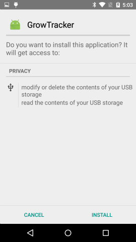](screenshots/install.png)
[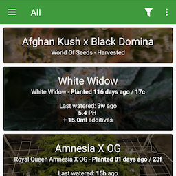](screenshots/1.png)
[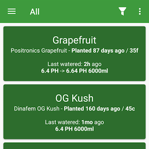](screenshots/1b.png)
[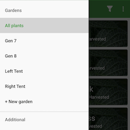](screenshots/1c.png)
[](screenshots/1d.png)
[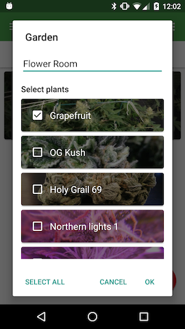](screenshots/1e.png)
[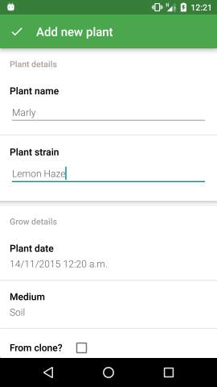](screenshots/2.png)
[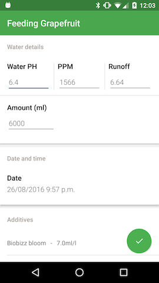](screenshots/3.png)
[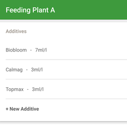](screenshots/4.png)
[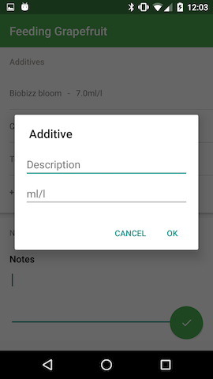](screenshots/4b.png)
[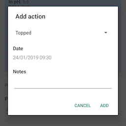](screenshots/5.png)
[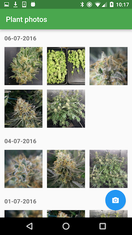](screenshots/6.png)
[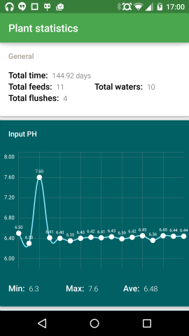](screenshots/7.png)
[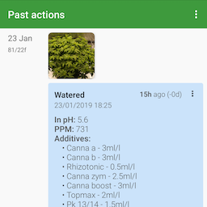](screenshots/8.png)
[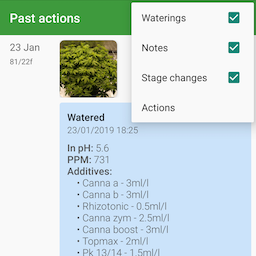](screenshots/9.png)
[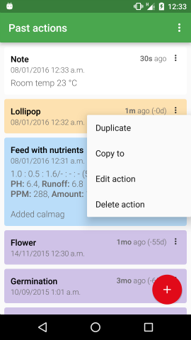](screenshots/10.png)
[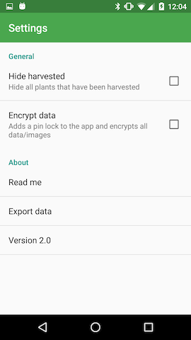](screenshots/11.png)
[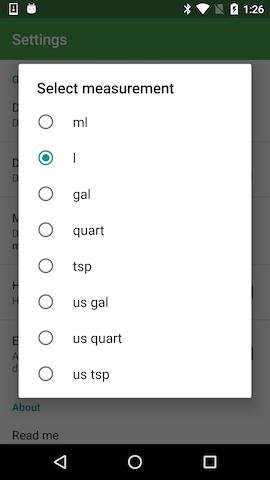](screenshots/12.png)

# About the app

The app uses a simple JSON structure to store all the data about the plants that can be found in `/sdcard/Android/data/me.anon.grow/files/plants.json`. All photos taken in the app are stored in `/sdcard/DCIM/GrowTracker/` in the corresponding plant id folder. `NOTE`: Photos will **not** show in any gallery app and will only be accessible through GrowTracker, or other **file** browser apps such as `ESFile Explorer`

The structure is very simple. Note: date timestamps are all unix timestamps from 1/1/1970 in milliseconds. All objects in arrays are in date order, where index 0 is the oldest and index (size - 1) is the newest.

## Prerequisites

Lombok is required for this project before you are able to compile. You can install it by going to `preferences->plugins->browse repositories->lombok plugin`

### Plant object

```
{
    "id": <String>,
    "actions": [<Action Object>],
    "images": [<String>],
    "name": "test",
    "strain": "test",
    "clone": <boolean>,
    "medium": <Medium>,
    "mediumDetails": <String>,
    "plantDate": 1234567890
}
```

### Medium (ENUM)

One of,

`SOIL`, `HYDRO`, `COCO`, `AERO`

### Plant Stage (ENUM)

One of,

`PLANTED`, `GERMINATION`, `CUTTING`, `VEGETATION`, `FLOWER`, `DRYING`, `CURING`, `HARVESTED`

### Action object (feeding)

Temperature measured in ºC


### Action object (water)

Temperature measured in ºC

Water action for waterings

```
{
    "additives": [<Additive>],
    "ph": <Double>,
    "ppm": <Long>,
    "runoff": <Double>,
    "amount": <Double>,
    "date": 1431268453111,
    "type": "Water",
    "temp": <Integer>
}
```

### Additive object - used for nutrients

```
{
    "description": <String>,
    "amount": <Double>
}
```

### Action object (other)

Action can be one of,

`FIM`, `FLUSH`, `FOLIAR_FEED`, `LST`, `LOLLIPOP`, `PESTICIDE_APPLICATION`, `TOP`, `TRANSPLANTED`, `TRIM`

```
{
    "action": <Action>,
    "date": 1431258118968,
    "type": "Action"
}
```

### Stage change

```
{
    "newStage": <Plant Stage>,
    "date": 1431258118968,
    "type": "StageChange"
}
```

### Note

```
{
    "notes": <String>,
    "date": 1431258118968,
    "type": "Note"
}
```

Image object is a simple string path to an image. Each image is named by the timestamp when it was taken, in milliseconds.

# Encryption

Note that this is **not** a guarantee form of encryption from law enforcement agencies.

Encryption in the app uses basic AES for encryption using the provided passphrase. If the passphrase is less than 128 bits (16 UTF-8 chars), it will be padded with `0x0` bytes. You can view the key generator method [here](https://github.com/7LPdWcaW/GrowTracker-Android/blob/master/app/src/main/java/me/anon/lib/helper/EncryptionHelper.java#L27)

You can decrypt your files using your passphrase either by writing a script that uses AES decryption, or an online tool such as [Online-Domain-Tools](http://aes.online-domain-tools.com/).

# License

Copyright 2014-2017 7LPdWcaW

Licensed under the Apache License, Version 2.0 (the "License");
you may not use this file except in compliance with the License.
You may obtain a copy of the License at

   http://www.apache.org/licenses/LICENSE-2.0

Unless required by applicable law or agreed to in writing, software
distributed under the License is distributed on an "AS IS" BASIS,
WITHOUT WARRANTIES OR CONDITIONS OF ANY KIND, either express or implied.
See the License for the specific language governing permissions and
limitations under the License.
